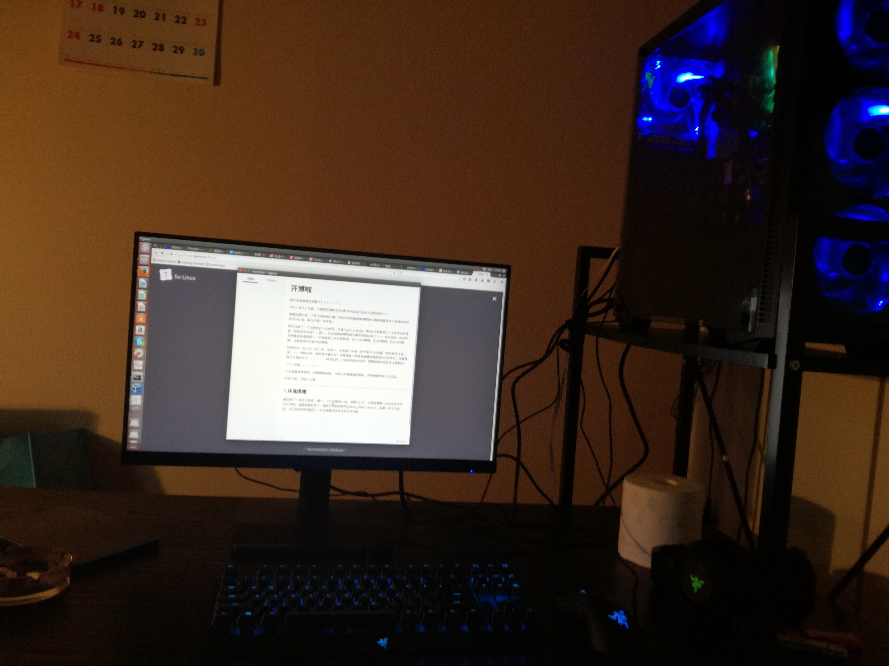

很久没有提笔写博客了！！！！！！！

作为一名IT工作者，不提笔写博客“吹牛逼”对不起自己技术人员的身份～～

顺带还要记录一下学习资料和心得，同时不停想要更新博客的心情也能督促自己完成未完成的学习计划，倒也不是一件坏事。

所以注册了一个全新的github帐号，开通了github page，用jelkyll模板做了一个技术向的博客（远远尚未完成），嘛～，反正目前能够完成文章的发布就够了～～，将来再去一点点的把博客装饰漂亮吧～（毕竟看别人代码好累啊，写html好累啊，写js好累啊，写scss好累啊，注册各类平台帐号好累啊）

目前作为一名三无（无工作，无收入，无老婆）苦逼（苦中作乐+大帅逼）青年(青年才俊，误～～)，闲赋在家，成天思忖着如何一夜暴富娶个老婆金屋藏娇逍遥海外为所欲为，再看看自己长茧的右手。。。。。。每当此时，才能深刻的体会到：理想和现实是有很大差距的。

<em>但是。。。</em>

人还是要有梦想的，就算要做咸鱼，也该立志做最咸的那条，否则和腊肉有什么区别。

闲话不说，开始入正题

***

### 1.硬件组装

最近做了一些什么事呢，嘛～，上个月脑袋一热，想要打LOL，于是想着整一台台式机平时打打游戏。屁颠屁颠的逛了一圈秋叶原和池袋的softmap和bic camera，结果一发不可收拾，自己购买配件组装了一台狂拽酷炫屌炸天的台式电脑!

（外设全是razer RPG变色的，机械键盘手感还是很好的～～）

（从桌子到电脑每一个配件都是自己亲手装上去的。。。）

忙完这些之后，只有一个字可以形容自己的感受：<strong>累</strong>

对于想要组装游戏电脑的一些心得：

* 千万别信店家销售员的，一定要杀价，不管东京南京北京西京普天之下都一样，杀价，往死里杀（整台机箱估计比最初报价少了一半左右）
* 如果要安装水冷，记得不要太着急装cpu，拆拆装装很麻烦有木有啊，调色时别手抖，否则一个不小心就跟我一样调成了紫黑色，一点色彩都看不出来T T
* 装电源和配线的时候，眼睛放亮点，线一般是只会多不会少的，插孔和主板插针也一样，进进出出，拔插拔插，要勤加练习，就熟悉了
* 一旦出现问题，比如画面无法正常显示，不要总想着是不是硬件或软件有问题，先从操作上技术层面找原因，正牌商家是不会给你邮寄劣质配件的，一般都是自己操作上出现了失误（一开始系统无法正常显示，以为是主板在安装过程中造成了局部损坏，后来发现是这奇葩会发光的内存条装反了，囧）

技术上详细的内容就没什么好详尽解释的，比如cpu供电是24pin的啊还是20pin的，另一根主线是8pin的啊还是6pin的啊，机箱电源开关是接pwd啊还是power啊啥的啊，重启是restart插针啊还是就一个res啊，ssd是IDE插口啊还是sata啊，另一根供电怎么接啊。多风扇情况下是否串联插主板还是直接接电源啊。。。。。。

无聊的问题都是浮云，长了眼睛，会利用网络，够酷炫够有趣就足够了。

### 2.环境搭建

既然整套游戏设备都完成了，终于可以开开心心的撸啊撸了吧～～，正当我满怀兴奋的打算一试沉睡已久的麒麟臂的时候。。。。。。。

呵呵

目前使用的系统还是ubuntu16.04LTS..............................................................................................................................................................................................................................................................................................................................................................................................................................................

windows系统家庭普通版大概需要17万日元，在秋叶原的softmap问了店家，目前整个秋叶原都没有货，市场上目前订购需要20万日元左右，还得等一周左右。。。。。。

这尼玛不是坑爹吗，对于从小玩盗版windows玩到大的哥哥来说，还得花1200元软妹币买一套正版windows10，尼玛还要等一个礼拜，这和掏钱买官还得跪着求人收钱不是一样的么，老子堂堂程序猿攻城狮。。。。。。

为了中华民族广大90后劳动人民的尊严，更是为了作为一个帅逼程序猿的尊严，我毅然决然地选择了linux后windows双系统，于是哥花了2000元日元不到买了一个u盘，在网吧坐了一个小时吃了一包零食+一桶泡面后潇洒的出来，合计不到3000日元，一颗闪闪发光的linux启动盘诞生了～～

系统装好了后，就该大白菜登场了吧，仿佛能够看到屏幕后面隐藏在黑暗中一颗集合着帅气和邪魅的脸庞露出了魅惑的一丝淫笑。。。。。。

但是，理想和现实总是有差距的 T T

第一次，使用gparted压缩硬盘的时候造成了ubuntu系统损坏，不得不再烧一次u盘

第二次，磁盘分区没有问题，但几乎所有windows装机程序都是.exe格式的，也就意味着在linux下根本无法使用，所以只能去官网下载正版镜像文件

第三次，正版.iso文件下载完了，使用	sudo dd if=win10.iso of=/dev/sdb 命令可以用来烧制win10启动盘，但是当上述一切程序准备完成的时候，重启电脑，在boot menu中可以找到u盘，却无法进入到安装程序

第四次，原来万恶之源是grub2，我的系统根本无法进入到grub中去！！！！！！，只有在插上u盘的时候，才能正确进入到grub，脱离u盘，一切皆为惘然。

第五次，任我多次重装grub，都无法正常进入到grub，总结原因，大概是压缩磁盘的时候造成了grub相关程序的损坏或文件丢失，所以脱离u盘就无法正常进入到grub，也就无法修改磁盘的主引导记录，结果就是进不到win10的安装程序，也就无法安装预先期望的先linux后windows的双系统。

一切悲剧来的总是这么的突然。。。。。。

解决方法：除了重装ubuntu，再无其他方法，除非你具有编写linux内核和ubuntu相关内核的能力，才有可能在不卸载ubuntu的情况下手动修复这个bug。

嘛～，系统都装了，又重来一遍多麻烦啊，反正能用，也不及，游戏可以以后再玩嘛～，人生最重要的是开心啊，随遇而安也没什么不好啊，反正也没什么硬性要求。

嘛～，就将就着这样用呗。	     	

于是就有了现在只有一个linux系统的状况，哭～～

### 3.ubuntu下工作环境

开源系统能够做什么啊？打不了游戏，没有主流音乐/电影软件，听个歌也麻烦的要死，还要天天面对一些纯工具向的软件。

但如果你对游戏本身也没什么太大兴趣呢（反正老子有ps4和任天堂还有一台win8笔记本和mac book。。。。。。貌似没什么资格吐槽～～）

libreoffice也很好用啊，浏览器也应有尽有啊，还自带了python啊，乱七八糟一大堆的工具啊，要下载什么东西直接一个apt install xxxxx就够了啊，比如要装个ruby，php啥的，方便的很啊，用惯了windows，还要去找到官网，下载一下，解压一下或安装一下，万年不变的next,next,next...finish，多麻烦啊，装完了还要配置环境变量，copy，paste，copy，paste......

归根结底，还是一种思维方式，用户习惯和需求方向的问题。只不过制定了人们这种行为习惯的是micsofft这种商业企业而已。

所以，程序猿才会钟情于linux。

但如果不去研究系统内核这种更加底层的架构和编程，貌似用linux也是一种很大的浪费～～。

只能说，目标决定了方向吧，逻辑无法连贯的话，本身就是一种损失。治学如此，处事如此，人生更是如此。

### 4.关于博客

话说搭建一个博客也真是麻烦啊，怀念以前哥还买过的虚拟服务器。国内的博客没有手机一概都注册不了啊，原本想着自己搭一个网站，不过真是麻烦啊，木有支付宝要注册个Palpay，又木有信用卡，还要买域名/服务器，买了还要不时地维护，还要自己写css，html，js，建database，写php或java，抠个图还要自己亲自动手，多麻烦啊，没个两周一个月根本不行，哥还要找工作混吃等死呢～～

所以，还是用git page吧，git的话，以前虽然有用过，但绝对算不上熟悉，就对add.   push  commit   checkout 这些稍微熟悉一点，不同环境下频繁使用的情况确实不算多。环境决定技术方向吧，没有刚需的情况下就没有人会去使劲～～（不过这么简单的东西，一两天就够了也没什么太大必要，就是分支经常搞混～～）

来来来，搭建博客，绑定git域名，fork模板仓库......网上教程太多了，没啥好说的。

唯一有点意思的地方，就是博客的文本格式是MARKDOWN格式的，HTML写多了，真觉得不好玩，话说现在正在使用的这个markdown编辑器好酷炫有木有啊，不管输入什么样的标签+内容，马上就能够实时的展示出来，又简洁颜值又高又方便又不卡，简直和哥一个样。还有一个像所有浏览器（IE从碗里滚粗）一样的调试工具，赛高～～～～～～～～～～～～

(界面又清爽又干净有木有啊～～，同时支持数学符号和各种其他符号输入～～)

### 5.那些操蛋的事情

首先是vitrulbox上安装kali linux

至于能够用它来做什么，呵呵，至少win10双系统的问题能够解决了～～

其次是要学习的内容

比如啊：啊啊啊啊啊啊啊啊啊啊啊啊啊啊啊～～，太多了，懒得说了。

堆了一大堆狗屁，一点技术上的深度学习内容都木有～～

当然，深度的内容要藏在脑袋里，哪能够轻易示人。

知识浅层上叫做技术，中层叫做技术详解，高层上就是思想体系。正如，

普通技术解决实时问题（诸如程序开发），中层技术养成习惯能够多角度宏观上解决问题（诸如搭建架构，写原型，造轮子），高层技术是人剑合一形成整体的体系思想进而嫩够影响到一个行业。

以后博客的学习和讨论内容试着向中层，也即是技术详解上靠拢，争取至多三天更新点学习内容吧，也好记录一下容易忘掉的和要做的事情。

难得的第一篇博客，记录一下，就这样了。

来世不当程序猿
