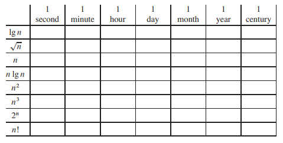
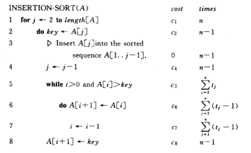
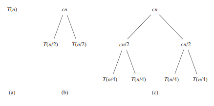
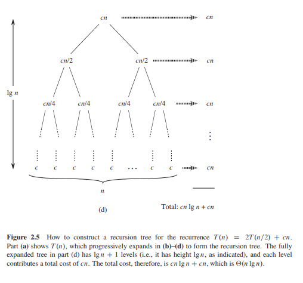

### 1.背景介绍

​	假设计算机无限快，并且计算机存储器是免费的，那么你还有任何理由去学习算法吗。因此，计算时间作为一种有限的资源，存储空间也是一种有限的资源，而我们如何有效
的利用这些有限的资源，正是“<b>时间复杂度</b>”和“<b>空间复杂度</b>”在算法学习中如此重要的意义。

	*插入排序和归并排序的复杂度比较* 
	问题:
	1.1-1
	Give a real-world example that requires sorting or a real-world example that requires computing a convex hull.
	1.1-2
	Other than speed, what other measures of efficiency might one use in a real-world setting?
	1.1-3
	Select a data structure that you have seen previously, and discuss its strengths and limitations.
	1.1-4
	How are the shortest-path and traveling-salesman problems given above similar? How are they different?
	1.1-5
	Come up with a real-world problem in which only the best solution will do. Then come up with one in which a solution that is “approximately” the best is good enough.
	1.2-1
	Give an example of an application that requires algorithmic content at the application level, and discuss the function of the algorithms involved.
	1.2-2
	Suppose we are comparing implementations of insertion sort and merge sort on the same machine. For inputs of size n, insertion sort runs in 8n^2 steps, while merge sort runs in 64n lgn steps. For which values of n does insertion sort beat merge sort?
	1.2-3
	What is the smallest value of n such that an algorithm whose running time is 100n^2 runs faster than an algorithm whose running time is 2^n on the same machine
	1-1 
	Comparison of running times
	For each function f(n) and time t in the following table, determine the largest size n of a problem that can be solved in time t, assuming that the algorithm to solve the problem takes f(n)microseconds.
	
	
### 2.基础知识

#### 2.1插入排序

  + 循环不变式

  + 时间复杂度和空间复杂度

  + 代码实现

        *c语言代码实现*

        问题：
        2.1-1
        Using Figure 2.2 as a model, illustrate the operation of INSERTION-SORT on the array A = {31,41,59,26,41,58}.
        2.1-2
        Rewrite the INSERTION-SORT procedure to sort into nonincreasing instead of nondecreasing order.
        2.1-3
        Consider the searching problem:
        Input: A sequence of n numbers A =(a1,a2,...,an) and a value .
        Output: An index i such that v=A[i] or the special value NIL if v does not
        appear in A.
        Write pseudocode for linear search, which scans through the sequence,looking for v. Using a loop invariant, prove that your algorithm is correct. Make sure that your loop invariant fulfills the three necessary properties.
        2.1-4
        Consider the problem of adding two n-bit binary integers, stored in two n-element arrays A and B. The sum of the two integers should be stored in binary form in an (n+1)/-element array C. State the problem formally and write pseudocode for adding the two integers.

#### 2.2算法分析

+ RAM(random-access machine)

+ 插入排序算法的分析

  插入排序过程的时间开销与输入有关

     

+ 最坏情况和平均情况分析

+ 增长的量级　　　　

  ​	Q-notation

  ```
  问题：
  2.2-1
  Express the function n＾3/1000-100n^2-100n+3 in terms of Q-notation.
  2.2-2
  Consider sorting n numbers stored in array A by first finding the smallest element of A and exchanging it with the element in A[1]. Then find the second smallest element of A, and exchange it with A[2]. Continue in this manner for the first n-1 elements of A. Write pseudocode for this algorithm, which is known as selection sort. What loop invariant does this algorithm maintain? Why does it need to run for only the first n-1 elements, rather than for all n elements? Give the best-case
  and worst-case running times of selection sort in Q-notation.
  2.2-3
  Consider linear search again (see Exercise 2.1-3). How many elements of the input sequence need to be checked on the average, assuming that the element being searched for is equally likely to be any element in the array? How about in the worst case? What are the average-case and worst-case running times of linear search in Q-notation? Justify your answers.
  2.2-4
  How can we modify almost any algorithm to have a good best-case running time?
  ```

#### 2.3算法设计

 + 分治法

        *1.过程分析 2.时间和空间复杂度 3.代码实现*
   ``` 
   问题：
   2.3-1
   Using Figure 2.4 as a model, illustrate the operation of merge sort on the array
   A=(3,41,52,26,38,57,9,49).
   2.3-2
   Rewrite the MERGE procedure so that it does not use sentinels, instead stopping once either array L or R has had all its elements copied back to A and then copying the remainder of the other array back into A.
     
      
   .......
   ```

+ 合并排序中对小数组采用插入排序
+ 冒泡算法
+ 霍纳规则

### 3.函数的增长

+ 渐近记号
+ 斐波那契函数
+ 其他运算

### 4.递归式


